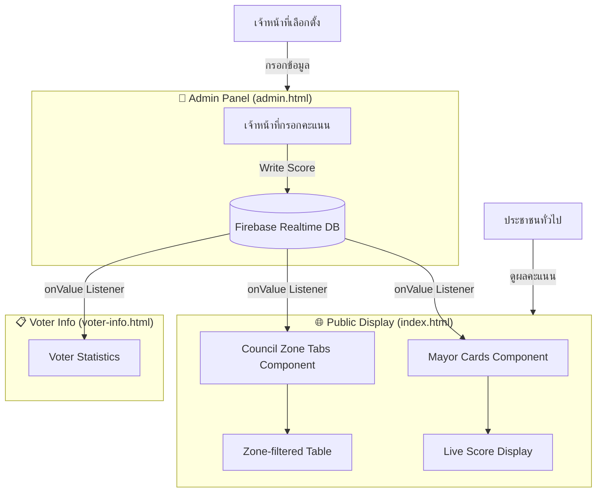

# 🗳️ Election Live Results — Pichai Municipality

[](#)
[](#)
[](#)
[](#)
[](#)

ระบบแสดงผลการเลือกตั้งแบบเรียลไทม์สำหรับ **เทศบาลเมืองพิชัย** — ออกแบบมาเพื่อให้ประชาชนติดตามผลคะแนนนายกเทศมนตรีและสมาชิกสภาเทศบาลได้ทันทีในคืนวันเลือกตั้ง **11 พฤษภาคม 2568** โดยไม่มี downtime แม้แต่วินาทีเดียว

> **Showcase Edition:** ข้อมูลผู้สมัครและคะแนนจริงถูกล้างออกแล้ว (PII-safe) คงไว้เฉพาะ architecture และ UI สำหรับแสดงเป็น engineering portfolio

---

## ✨ ฟีเจอร์หลัก

- **📡 Real-Time Score Updates** — คะแนนอัพเดทอัตโนมัติผ่าน Firebase Realtime Database ทันทีที่เจ้าหน้าที่กรอกข้อมูล ไม่ต้อง refresh
- **🏛️ Mayor Candidate Cards** — แสดงการ์ดผู้สมัครนายกพร้อมรูปภาพ หมายเลข และคะแนนสะสมแบบ live
- **📊 Council Results by Zone** — แสดงผลสมาชิกสภาแยกตามเขตเลือกตั้ง พร้อมระบบแท็บสลับเขต
- **🔐 Admin Panel** — หน้าจัดการสำหรับเจ้าหน้าที่กรอกคะแนนแบบ real-time
- **📋 Voter Information Page** — หน้าข้อมูลผู้มีสิทธิ์และสถิติการเลือกตั้ง
- **🕐 Live Buddhist Calendar Clock** — นาฬิกาเรียลไทม์แสดงวันเวลาตามปฏิทินไทย (พ.ศ.)
- **🎬 Candidate Row Animation** — Slide-in animation เมื่อโหลดรายชื่อผู้สมัคร

---

## 🛠️ Tech Stack

| Layer | Technology | หน้าที่ |
| :--- | :--- | :--- |
| **Frontend** | Vanilla JavaScript (ES6+), HTML5 | UI หลักและ DOM manipulation |
| **Styling** | TailwindCSS 2.x (CDN) + Custom CSS | Responsive layout และ component styles |
| **Database** | Firebase Realtime Database | เก็บและ sync คะแนนแบบ real-time ผ่าน WebSocket |
| **Hosting** | Firebase Hosting | Static site deployment พร้อม CDN global |
| **Font** | Sarabun (Google Fonts) | ฟอนต์ภาษาไทยสำหรับ UI |

---

## 📊 System Architecture



---

## 🗄️ Firebase Data Structure

```json
{
  "mayors": [
    {
      "name": "ชื่อผู้สมัคร",
      "number": 1,
      "party": "ชื่อพรรค/กลุ่ม",
      "imageUrl": "url_to_image",
      "score": 0
    }
  ],
  "zones": [
    {
      "id": "zone1",
      "name": "เขต 1",
      "candidates": [
        {
          "name": "ชื่อผู้สมัคร",
          "number": 1,
          "score": 0
        }
      ]
    }
  ]
}
```

---

## 🚀 วิธีรันในเครื่อง

### ข้อกำหนด
- Node.js 16+
- Firebase CLI (`npm install -g firebase-tools`)
- Firebase project (สร้างได้ที่ [console.firebase.google.com](https://console.firebase.google.com))

### ขั้นตอน

```bash
# 1. Clone repository
git clone https://github.com/kyosuke11z/election-live-results.git
cd election-live-results

# 2. ตั้งค่า Firebase config ใน docs/script.js
# แทนที่ firebaseConfig ด้วยค่าจาก Firebase project ของคุณ

# 3. รัน local server
npx serve docs
# หรือเปิด docs/index.html ใน browser โดยตรง
```

### Deploy ด้วย Firebase Hosting

```bash
firebase login
firebase use --add   # เลือก project
firebase deploy
```

---

## 📁 โครงสร้างไฟล์

```
election-live-results/
├── docs/
│   ├── index.html          # หน้าแสดงผลสาธารณะ (Mayor + Council)
│   ├── admin.html          # หน้า Admin สำหรับกรอกคะแนน
│   ├── voter-info.html     # หน้าข้อมูลผู้มีสิทธิ์เลือกตั้ง
│   ├── script.js           # Firebase listeners + UI logic
│   └── img_placeholder_person.png
├── firebase.json           # Firebase Hosting config
├── .firebaserc             # Firebase project alias
└── package.json
```

---

## 🎯 Key Engineering Decisions

**ใช้ Firebase `onValue` listener แทน polling** — ทำให้ UI อัพเดทอัตโนมัติผ่าน WebSocket ทันทีที่ข้อมูลเปลี่ยน ไม่มี latency จาก interval-based polling

**ไม่ sort คะแนน real-time** — จงใจไม่ sort mayor cards ตามคะแนน เพื่อป้องกัน layout shift ที่ทำให้ผู้ชมสับสนขณะนับคะแนน

**DocumentFragment สำหรับ batch DOM update** — render candidate cards ทั้งหมดใน fragment ก่อนแล้วค่อย append ครั้งเดียว ลด reflow/repaint

---

## 📝 License

MIT License — สามารถนำ architecture ไปปรับใช้กับการเลือกตั้งท้องถิ่นอื่นได้อย่างอิสระ
